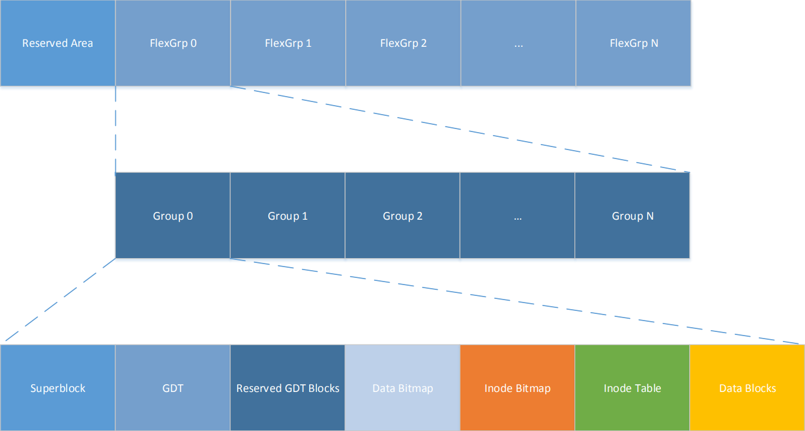
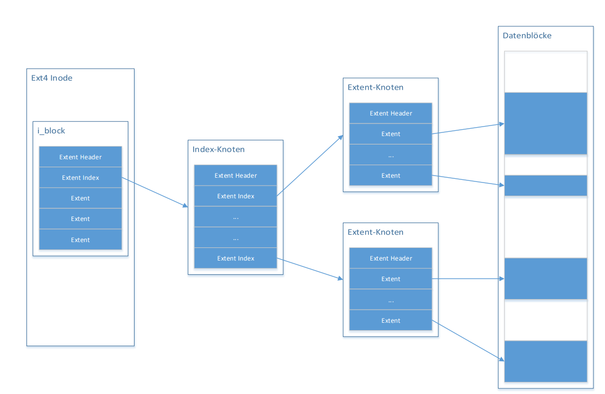
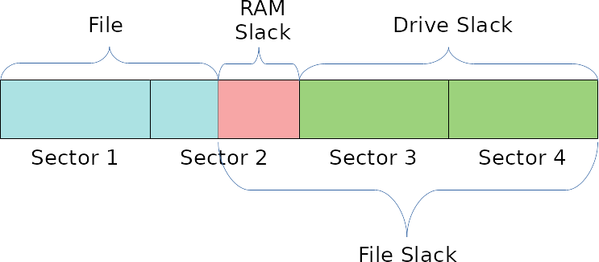

Background
==========

Filesystem Data Structures
--------------------------

This chapter summarizes the most important data structures of FAT, NTFS and ext4.

FAT
...

Despite its age, the FAT filesystem is a heavily used filesystem, most often
found on small sized devices such as USB sticks and SD-Cards.
Its simple structure makes it easy to understand and lightweight implementations
are possible.
During its evolution the original FAT specification was extended to fit the
growing disk sizes of hard drives, and resulted in various variants.
Nowadays, the most common variants are FAT12, FAT16 and FAT32.
Besides some details, which we will cover later, the main difference between
these FAT types is the address size, used for addressing clusters in
the data area.
All three FAT types share a similar structure, consisting of

* reserved sectors, including the bootsector
* file allocation table
* root directory region
* data region

Important units in a FAT filesystem are `sectors` as the smallest logical unit
for the pre data region and `clusters` as the smallest logical unit in the data
region. The size of a cluster is defined by `cluster size = sector size * 
sectors per cluster`.

Reserved Sectors
****************

Reserved sectors are always located at the beginning of a FAT filesystem. The
most important types are the bootsector, which starts at offset 0 and the
FS Information Sector which is used by FAT32.

Bootsector
**********

The bootsector contains important metadata about the filesystem. It constists
of a core section, which is the same for every FAT type, and an extended region,
which differs across the different types.

Among others, the core region of the bootsector includes the sector size,
the count of sectors per cluster and the count of root directory entries.

The extended region stores the filesystem type value.
FAT32 filesystems also store the address of the root directory cluster and the
start value of the FS information sector here.

FS Information Sector
*********************

FAT32 includes a Filesystem information sector in the reserved sectors. It stores
some additional metadata about the filesystem, which can be used to increase
read and write performance. Interesting values are the count of free sectors
and the id of the last written cluster.

File Allocation Table
*********************

The File Allocation Table records the status of data clusters. Depending on the
type the size varies between 12 to 32 bit per record. Mainly there are four
different status values.

* Free cluster
* Bad cluster
* Last cluster
* Next cluster in a cluster chain

The free cluster status is used to mark a cluster as free.
This means, that during the write process this cluster can be used to write
data into.
If data was written into a cluster, the corresponding FAT entry is set to
the last cluster value.
If the written file is greater than the cluster size, multiple clusters will
be allocated. The first cluster then points to the id of the next cluster, 
creating a chain of used clusters. The last cluster in this chain is terminated
with the 'Last cluster' value.
The bad cluster status indicates a faulty sector in this cluster.
Once this status is set, the filesystem will never use this cluster again.

Root- and Subdirectories
************************

The root directory holds the start directory of the filesysten ("/"). For FAT12 and
FAT16 it starts directly behind the file allocation table. The location in FAT32
filesystems is determined by the `Root directory address` field of the bootsector.
It holds a series of directory entries.

A directory entry stores information about a file or subdirectory:

* Name
* Extension
* Attributes (subdirectory, hidden, readonly, ...)
* start cluster
* size

Subdirectory entries use the `start cluster` field to point to a cluster
that then again holds a series of directory entries.

NTFS
....

The New Technologies File System (NTFS) was designed by Microsoft and is the standard file system of Microsoft operating systems
starting from Windows NT/2000. NTFS is a significantly more complex file system than FAT with many features to enhance reliability,
security and scalability. Unfortunately, there is no official published specification for NTFS from Microsoft and low-level details
can only be found in unofficial descriptions.

Everything is a File
********************

"Everything is a File" is the most important concept in the design of NTFS. Each byte of an NTFS file system belongs to a file and
the entire file system is considered a data area. Even system data and meta data, which are usually hidden by other file systems,
are allocated to files and could be located anywhere in the volume. Consequently, NTFS file systems do not have a specific layout
apart from the first sectors of the volume containing the boot sector and initial program loader.

Master File Table
*****************

The Master File Table (MFT) contains an entry for every file and directory stored in a NTFS partition. It contains the necessary
metadata such as the file name, -size, and the location of the stored data. MFT entries allocate a fixed size, usually 1024 bytes,
but only the first 42 bytes have a defined purpose (MFT Entry Header). The remaining bytes store attributes, which contain the
metadata for a file (e.g.: $STANDARD_INFORMATION, $FILE_NAME, $DATA).

File System Metadata Files
**************************

NTFS stores its administrative Data in metadata files, which contain central information about the NTFS file system. Their names
start with dollar character $ and the first letter is capitalized (except for ’.’). Microsoft reserves the first 16 MFT entries
for file system metadata files. The following table contains the standard NTFS file system metadata files (Brian Carrier, p.202):

+-------+-----------+--------------------------------------------------------------------------------------------------------------------------------------------------------+
| Entry | File Name | Description                                                                                                                                            |
+-------+-----------+--------------------------------------------------------------------------------------------------------------------------------------------------------+
| 0     | $MFT      | TheThe entry for the MFT itself.                                                                                                                       |
+-------+-----------+--------------------------------------------------------------------------------------------------------------------------------------------------------+
| 1     | $MFTMirr  | Contains a backup of the first entries in the MFT.                                                                                                     |
+-------+-----------+--------------------------------------------------------------------------------------------------------------------------------------------------------+
| 2     | $LogFile  | Contains the journal that records the metadata transactions.                                                                                           |
+-------+-----------+--------------------------------------------------------------------------------------------------------------------------------------------------------+
| 3     | $Volume   | Contains the volume information such as the label, identifier, and version.                                                                            |
+-------+-----------+--------------------------------------------------------------------------------------------------------------------------------------------------------+
| 4     | $AttrDef  | Contains the attribute information, such as the identifier values, name, and sizes                                                                     |
+-------+-----------+--------------------------------------------------------------------------------------------------------------------------------------------------------+
| 5     | .         | Contains the root directory of the file system.                                                                                                        |
+-------+-----------+--------------------------------------------------------------------------------------------------------------------------------------------------------+
| 6     | $Bitmap   | Contains the allocation status of each cluster in the file system                                                                                      |
+-------+-----------+--------------------------------------------------------------------------------------------------------------------------------------------------------+
| 7     | $Boot     | Contains the boot sector and boot code for the file system.                                                                                            |
+-------+-----------+--------------------------------------------------------------------------------------------------------------------------------------------------------+
| 8     | $BadClus  | Contains the clusters that have bad sectors                                                                                                            |
+-------+-----------+--------------------------------------------------------------------------------------------------------------------------------------------------------+
| 9     | $Secure   | Contains information about the security and access control for the files                                                                               |
+-------+-----------+--------------------------------------------------------------------------------------------------------------------------------------------------------+
| 10    | $Upcase   | Contains the uppercase version of every Unicode character.                                                                                             |
+-------+-----------+--------------------------------------------------------------------------------------------------------------------------------------------------------+
| 11    | $Extend   | A directory that contains files for optional extensions. Microsoft does not typically place the files in this directory into the reserved MFT entries. |
+-------+-----------+--------------------------------------------------------------------------------------------------------------------------------------------------------+

EXT4
....

The fourth extended filesystem is ext3s successor in linux's journaling filesystems, 
firstly published in 2006 by Andrew Morton. It still supports ext3, but uses 48bit for
block numbers instead of 32bit. This results in bigger partitions up to 1 EiB. Furthermore it 
is now possible to use extends, which unite serveral contigunous blocks, improving 
handling of large files and performance. Moreover ext4 introduces better timestamps on a 
nanosecond basis, checksums for its journal and metadata, online defragmentation, flex groups and 
other improvements.

The standard block size for ext4 is 4096 byte, but 1024 and 2048 are possible, too. These 
interfere with the 'superblock-slack' hiding technique shown later. 
The filesystem itself consists of a bootsector and flex groups, holding block groups.

Superblock
**********

The superblock contains general information about the filesystem bock counts, sizes,
states, versions, timestamps and others. It is located at byte 1024 of the filesystem and 
uses 1024 byte of its block, creating a superblock-slack (depending on the block size).
Redundant copies of the superblock are stored in block groups with numbers 0 and to the
power of 3, 5 and 7, unless the sparse_super feature flag is not set, which will store these
redundant copies in each block group.
Entries are amongst other information:

* total block and inode count
* blocks per block group
* unused block count
* first unused inode
* reserved GDT block count

GDT
***

The Group Descriptor Table is located behind the superblock in the filesystem and 
gets stored accordingly. It holds group descriptor entries for each block group, containing:

* address of block bitmap
* address of inode bitmap
* address of inode table
* unused block, inode and directory count
* flags
* checksums

Inodes
******

An inode stores metadata of a file, such as:

* timestamps
* user/group permissions
* data references

The size varries, default is 256 Byte. An inode table holds a list of all inodes of its block group.

Inode Extends
*************

The extents replace ext3s indirect addressing and reduce data fragmentation. An inode can store 4 extents,
further extents can be stored in a tree structure, each mapping up to 128MiB of contiguous blocks.

Reserved GDT Blocks
*******************

These blocks are reserved for expansion of the filesystem, which creates larger group descriptor tables.
Therefore it is usable for datahiding as long as the filesystem does not get expanded.

Journal
*******

The journal guarantees a successful write operation. After a committed data transaction is written to the disk,
it is saved to a 128MiB big section on the disk, the journal. From there it gets written to its final 
destination and can be restored in case of a power outage or data corruption during the write operation.

Hiding Techniques
-----------------

Following sections give a brief overview about each implemented hiding technique.

File Slack
..........

The smallest unit in the data area of a filesystem is called "cluster", or "block" in the case of ext4.
This unit is a fixed size value, that can often be configured at creation time
of the filesystem.
It is calculated from the `sector size * sectors per cluster`.
If a file is smaller than the cluster size of the filesystem, writing this file
will result in some unusable space, which starts at the end of the file and ends
at the end of the cluster.
This remaining space can be used to hide data and is in general called File Slack.

The File Slack itself consists of two parts: RAM Slack and Drive Slack.
The RAM Slack begins at the end of the file and ends at the end of the current
sector.
The Drive Slack reaches from the end of RAM Slack to the end of the cluster.

Most filesystem implementations for FAT and NTFS pad the RAM Slack with zeros,
nowadays. This padding behaviour must be honoured by our implementation, as
non-zero values in this area would be suspicious to any observer.

We can use these observations to define the general process of hiding data into
the File Slack.

1. Find the last cluster of a file, which File Slack shall be exploited
2. Calculate the start of the Drive Slack
3. Write data until no data is left or the end of the cluster is reached

In case of ext4 filesystems, most implementations pad the complete File Slack with zeros,
making the distinction between RAM and Drive Slack unnecessary but also making the detection
of hidden data more likely.

Our implementation for ext4 therefore calculates the end of a file on the filesystem
and writes data into the following File Slack until no data is left or the end of the current
block is reached

MFT Entry Slack
...............

The Master File Table (MFT) contains contains the necessary metadata for every file and directory
stored in a NTFS partition (see section 'Filesystem Data Structures'). An MFT entry does not have
to fill up all of its allocated bytes, which often leads to some unused space at the end of an entry.

In most implementations this unused space, the MFT entry slack, can still contain data of an old MFT entry,
which was previously stored in the same location (was not the case with ntfs-3g 2013.1.1.13AR.1 driver).
This makes the MFT entry slack an suitable place to hide data inconspicuously.

NTFS uses a concept called Fixup (Brian Carrier, p.253) for its important data structures,
such as the MFT, in order to detect damaged sectors and corrupt data structures. When an
MFT entry is written to the disk the last two bytes of each sector are replaced with a
signature value. To avoid damaging the MFT it is important to not overwrite the last two
bytes of each sector when hiding data in the MFT entry slack.

NTFS stores a copy of at least the first four MFT entries ($MFT, $MFTMirr, $LogFile, $Volume)
in a file called $MFTMirr (Brian Carrier, p.219) to be used during recovery. To avoid detection
by a simple chkdsk it is important to write a copy of the hidden data in $MFT to the corresponding
entries in $MFTMirr.

The process of hiding data in the MFT entry slack:

1. Find the MFT entry to hide data in
2. Calculate the slack, using the information in the MFT entry header
3. Write data and avoid the last two bytes of each sector
4. If copies exit in $MFTMirr write the same data there

Bad Cluster Allocation
......................

If a sector or a cluster of sectors is damaged, read and write operations would lead to faulty data.
Therefore the filesystem marks the affected area as bad and saves the address for future reference.
The filesystem won't try to use those marked areas anymore.
By marking some actually free clusters as faulty ones, we can reserve them for hiding data in it.

In NTFS filesystems, affected areas are saved in an MFT file entry called $BadClus, the entries in this file will be ignored.
In FAT filesystems, clusters are marked as bad in the File Allocation Table.

To hide data in a bad cluster:

1. Calculate size of data to hide
2. Find and save free clusters
3. Write data into the clusters
4. For NTFS: Add address of the used clusters to $BadClus, mark their positions in $Bitmap as allocated.
   For FAT: Set the cluster values of the corresponding File Allocation entries  to 'bad' marker

Additional Cluster Allocation
.............................

Clusters are either unallocated or allocated to a file. By allocating an actually unallocated cluster
to a file, the filesystem will not try to allocate that cluster and write file data to it, and data can be hidden
in that cluster. If the file the cluster is allocated to grows in size and exceeds the boundary of
its originally allocated clusters, the file will grow into the additionally allocated cluster
and overwrite the hidden data, so a file which is unlikely to grow should be chosen.

The procedure is as follows:

1. Calculate how many additional clusters to allocate
2. Find that many unallocated clusters and allocate them to a file
3. For NTFS: Change the allocated size attribute of that file depending on how many clusters were added

Reserved Group Descriptor Tables
................................

As described in the filesystem chapter above, the reserved GDT blocks are not used until the filesystem
is expanded and group descriptors are written to them. The reserved GDT blocks are located behind the
group descriptors and in each of its copies, their number can read from the superblock at 0xCE.
This hiding technique can hide up to `number of reseved GDT blocks * number of block groups with copies * block size`
bytes. The number of copies varies depending on the sparse_super flag, which limits the copies of the reserved
GDT blocks to group numbers with numbers of either 0 or to the power of 3,5 or 7, as described earlier.
On a 512Mb image with block size of 4096 bytes you can expect to hide about 64 * 2 * 4096 = 524288 Bytes.

However, this hiding method is quite obvious and might be one of the first places to look at in case you
check a ext4 filesystem for hidden data. Therefore this technique skips the original gdt and its first
copy before writing data. This prevents the file checker from noticing these flaws in the filesystem.

Process-wise the hiding technique firstly calculates the ids of reserved GDT blocks, using the
available information from the superblock, such as total block count, blocks per group and the
filesystem's architecture (32 or 64bit) as well as the total number of reserved GDT blocks and considering
the sparse_super flag.
Each block group's reserved GDT block ids get written to an array of block ids and data can be written.

Advantages of this technique are the size of possible hidden data, on the other hand hidden data would be
overwritten in case of a filesystem expansion and its quite easy to find.

Superblock Slack
................

Depending on the block size, there is an acceptable amount of slack space following each copy of the superblock
in each block group. This is not applicable in case the block size is 1024 due to the superblock's size of 1024
byte, using all of its block alone. For the superblock's copies the sparse_super flag applies, too, which means
less hiding space if the flag is set.
Size-wise we speak in dimensions of several Kb, each copy adding block_size - 1024 bytes of hiding space.
The first superblock makes an exception here, due to the bootsector using another 1024 bytes, leaving
`block_size - 2048 bytes` to hide data with block size 4096.

The hiding technique collects all block ids of the superblock copies from each block group,
taking the sparse_super flag under account. The data then gets written to the slack space of each of
these blocks, considering the filesystem's block size.

This hiding technique benefits from the superblock's characteristics, resulting in a safe storage because the
superblock slack space does not get overwritten. But like all slack space hiding methods this is easy to find,
too.

Inode
.....
osd2
****

The osd2 hiding technique uses the last two bytes of the 12 byte osd2 field, which is located at 0x74 in each inode.
This field only uses 10 bytes at max, depending on the tag being whether `linux2`, `hurd2` or `masix2`.
This results in `number of inodes * 2 bytes` hiding space, which is not much, but might be enough for small amounts
of valuable data, because its not easy to find. "Unfortunately" ext4 introduced a lot of checksums for all
kinds of metadata, which leads to invalid inode checksums.
In an ~235Mb image with 60.000 inodes this technique could hide 120.000 bytes.

To hide data, the method writes data directly to the two bytes in the osd2 field in each inode, which address is
taken from the inode table, until there is either no inode or no data left. The method is currently limited to 4Mb.

obso_faddr
**********

The obso_faddr field in each inode at 0x70 is an obsolete fragment address field of 32bit length.
This technique works accordingly to the osd2 technique, but can hide twice the data.
Taking the 235Mb example from above, this method could hide 240.000 bytes.
Besides that it has the same flaws and advantages.

